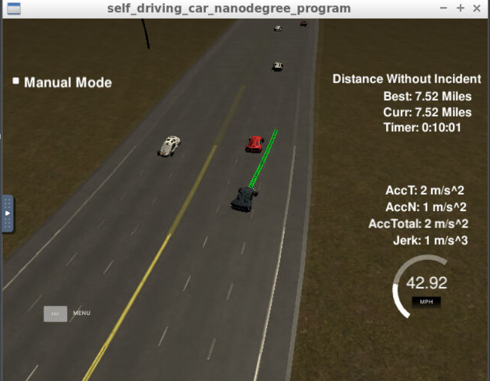

# Path Planning Project
---

## Goals

In this project your goal is to safely navigate around a virtual highway with other traffic that is driving +-10 MPH of the 50 MPH speed limit. Car's localization and sensor fusion data are provided, there is also a sparse map list of waypoints around the highway. The car should try to go as close as possible to the 50 MPH speed limit, which means passing slower traffic when possible, note that other cars will try to change lanes too. The car should avoid hitting other cars at all cost as well as driving inside of the marked road lanes at all times, unless going from one lane to another. The car should be able to make one complete loop around the 6946m highway. Since the car is trying to go 50 MPH, it should take a little over 5 minutes to complete 1 loop. Also the car should not experience total acceleration over 10 m/s^2 and jerk that is greater than 10 m/s^3.


## Data provided

Each waypoint in the list contains  [x,y,s,dx,dy] values. x and y are the waypoint's map coordinate position, the s value is the distance along the road to get to that waypoint in meters, the dx and dy values define the unit normal vector pointing outward of the highway loop.

The highway's waypoints loop around so the frenet s value, distance along the road, goes from 0 to 6945.554.

Here is the data provided from the Simulator to the C++ Program

#### Main car's localization Data (No Noise)

["x"] The car's x position in map coordinates

["y"] The car's y position in map coordinates

["s"] The car's s position in frenet coordinates

["d"] The car's d position in frenet coordinates

["yaw"] The car's yaw angle in the map

["speed"] The car's speed in MPH

#### Previous path data given to the Planner

//Note: Return the previous list but with processed points removed, can be a nice tool to show how far along
the path has processed since last time. 

["previous_path_x"] The previous list of x points previously given to the simulator

["previous_path_y"] The previous list of y points previously given to the simulator

#### Previous path's end s and d values 

["end_path_s"] The previous list's last point's frenet s value

["end_path_d"] The previous list's last point's frenet d value

#### Sensor Fusion Data, a list of all other car's attributes on the same side of the road. (No Noise)

["sensor_fusion"] A 2d vector of cars and then that car's [car's unique ID, car's x position in map coordinates, car's y position in map coordinates, car's x velocity in m/s, car's y velocity in m/s, car's s position in frenet coordinates, car's d position in frenet coordinates. 

---


## Logic for path planning (based on data provided)

The vital information regarding other cars is the position of the cars in terms of the frenet coordinates. The car's s position tells us how close is the car to us along the lanes, the car's d position tells us which lane is the car in.

The logic for path planning is simple:

1. Try to retain a speed close to sub 50 Mph at all times
2. Slow down and prevent collision when a car is too close.
3. When a car is too close, check whether the lane/lanes to the side of the current car lane is clear to switch lane
4. If clear to switch lane, switch lanes.

Important ideas to keep in mind:

- When increasing/decreasing speed, speed has to be changed slowily to prevent jerk.
- We can use the `s` coordinate to determine how close is the car and `d` coordinate to determine whether is the car in our current lane.
- The `s` distance of other cars that we use is a projected distance through time. We can do this by multiplying the distance with the current car speed and projecting it according to the amount of waypoints left that our current car has not gone through. By doing so, the distance estimated will be more safe.
- Check all vehicles and filter out on whether are there cars preventing us from changing lanes

## Path planning (Vital part of the codes, `/src/main.cpp`)

1: Determine whether are we too close (note: lane_clearing flags are defaulted to `true`)

```cpp
// do a trajectory projection in terms of s (frenet):

check_car_s += (double)prev_size * 0.02 * check_speed;
double difference_s = check_car_s - car_s;

// Logic 1: Detecting Car in front of our car. Same lane and it is in front 
bool s_close = difference_s > 0 && difference_s < 30.0 ; // Is the car close and in front?

if ( s_close && get_current_lane(d) == lane) { // Is the close car in the same lane as us?

too_close = true;  // we are close to the car in front of us

frontcar_speed = check_speed; //speed of the car in front

if(difference_s <= 3.0)  sharp_brake = true; // need to brake more if we are too close (car suddenly coming into our lane)

// Put a false flag to clearing flag for the lane that we are in (lane clear flag is used for switching lane so it does not make sense to switch to the lane 
// we are already in

if (lane == 0) left_clear = false;
if (lane == 1) middle_clear = false;
if (lane == 2) right_clear = false;
                                   
} 

```

2: If we are too close, are other lanes clear for us to switch lanes?

```cpp
double to_clear_dist = 15.0; //distance that we happy to declare the lane as clear
bool lane_not_clear = fabs(difference_s) < to_clear_dist ;

if(lane_not_clear) {  // Within the scanning range, check for cars, if there is car in the lane then set clear flag to false

// Put a false flag to lanes where there are cars preventing us from switching lanes:
// S coordinate, Left: 0 , Middle: 1  , Right: 2

       if (get_current_lane(d) == 1 )  middle_clear = false;

       if (get_current_lane(d) == 0  ) left_clear = false;

       if (get_current_lane(d) == 2  ) right_clear = false;
                            
}

```

3: With our flags set, lanes will be switched accordingly. *NOTE*: We won't go across two lanes at once.

```cpp
 if(too_close){
                          

    if (right_clear && lane != 0)  lane = 2;  // can only go right if you are in the middle	(prevent switching two lanes at once)
    if (left_clear && lane != 2) lane = 0;  // can only go left if you are in the middle  (prevent switching two lanes at once)					
    if (middle_clear)  lane = 1;  
    
 }
```


## Results to strive for:



**12102.27 meters in 10 minutes.** You can achieve this as long as the car is smart enough to switch lanes when necessary!

---
## Try it for yourself:

Go to the main repo from Udacity at [*HERE*](https://github.com/udacity/CarND-Path-Planning-Project). All of the set up information is provided for you. Message me over at [LinkedIn](https://www.linkedin.com/in/timothylimyonglee/) if you want to discuss more about the project.
